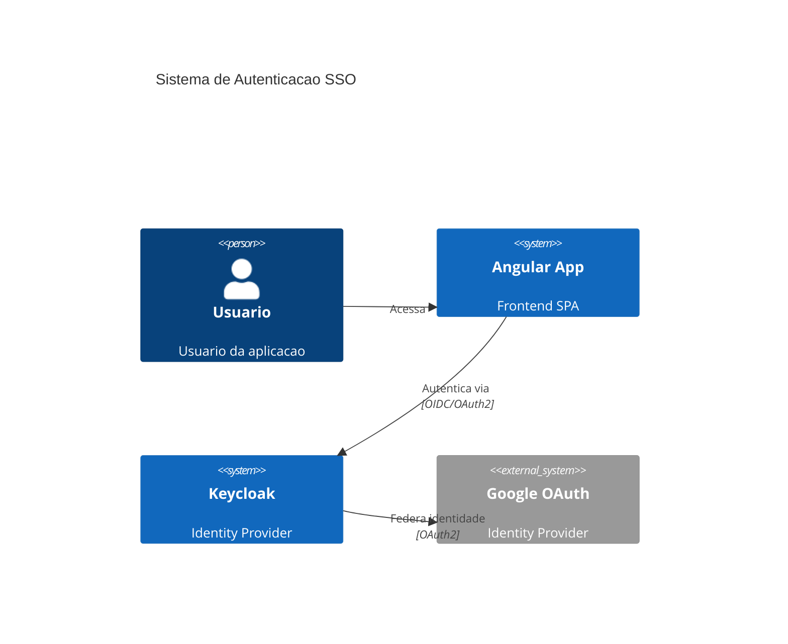
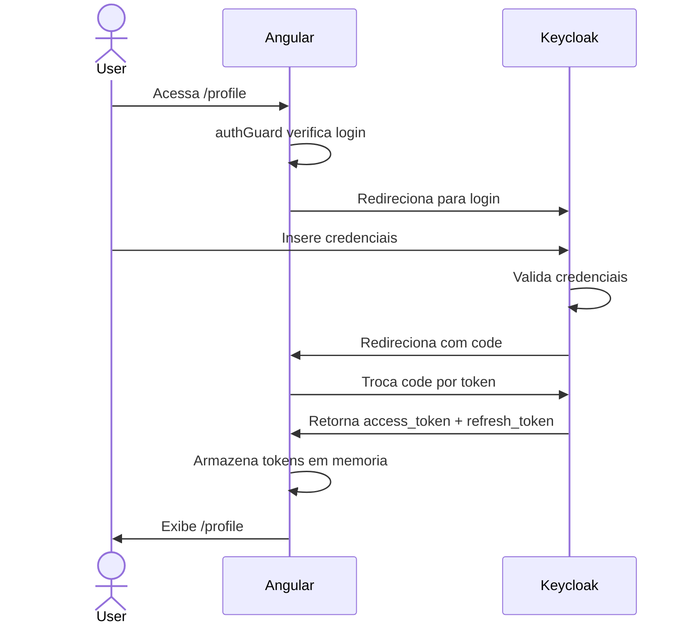
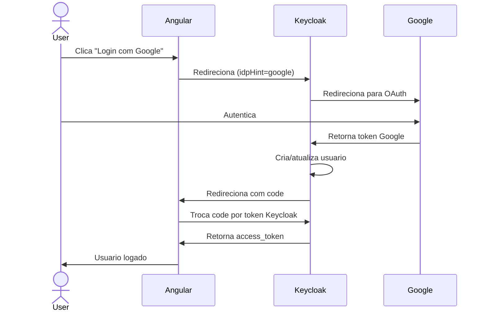
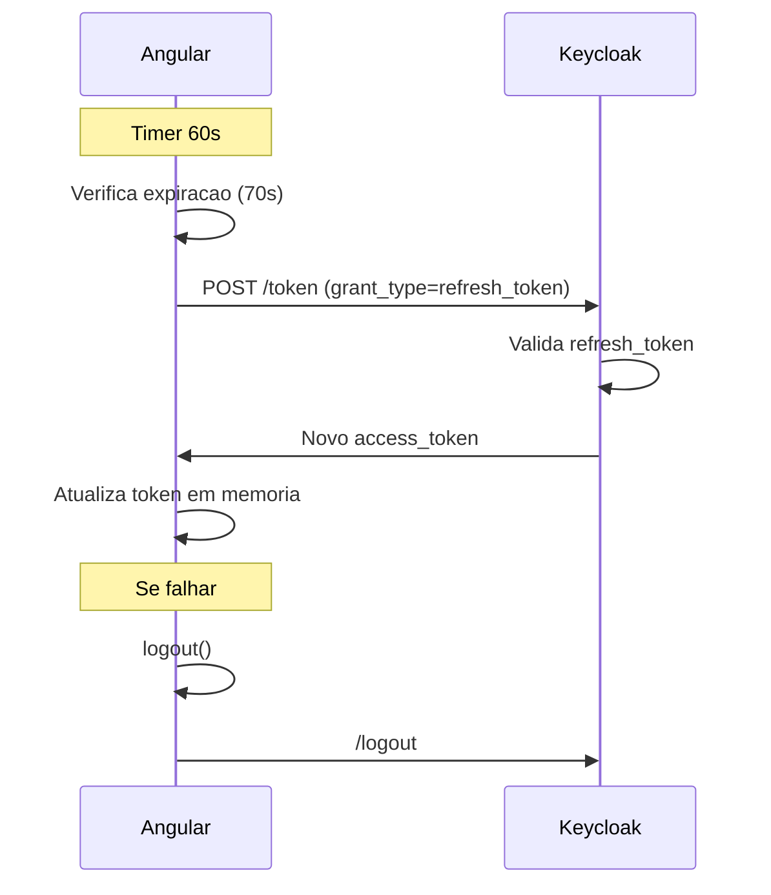
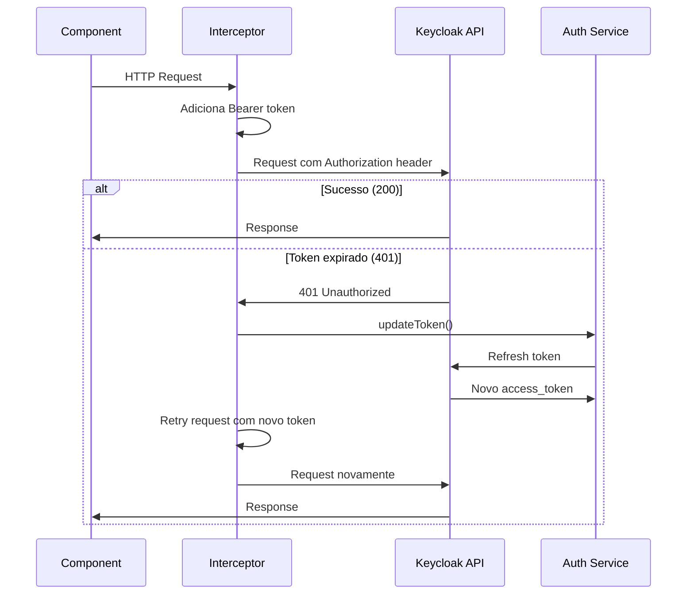
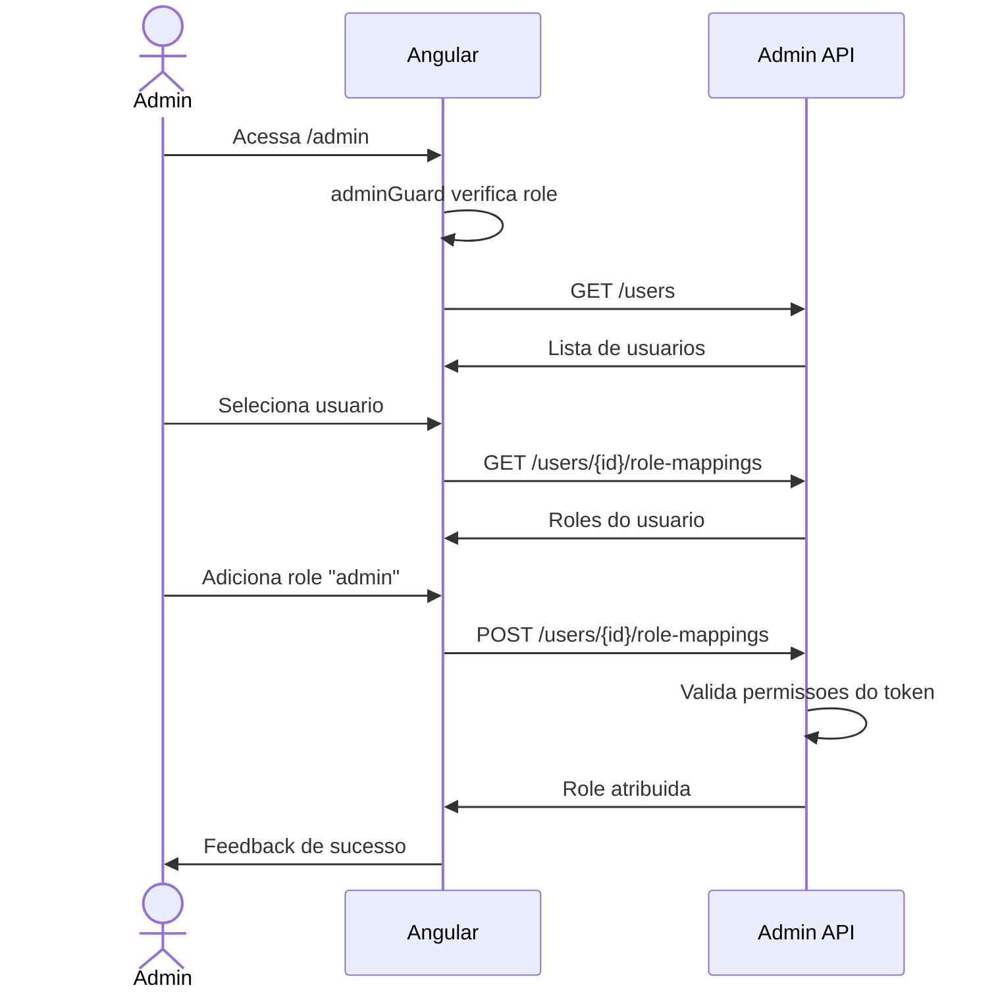
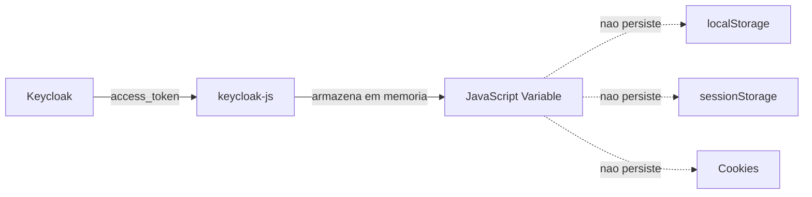
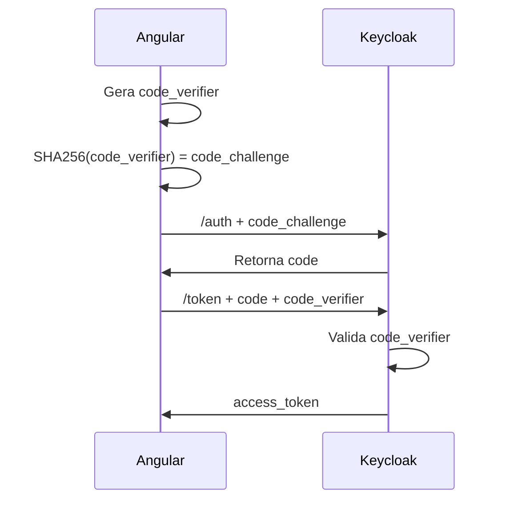
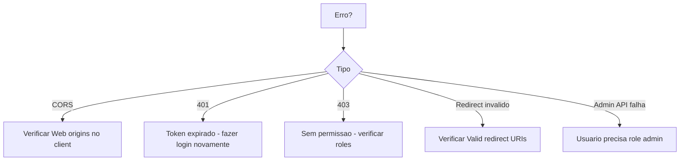

# Documentacao POC Keycloak + Angular

## Arquitetura



## Estrutura do Projeto

```
src/app/
├── core/
│   ├── services/
│   │   ├── auth.service.ts       # Autenticacao
│   │   └── user.service.ts       # Admin API
│   ├── guards/
│   │   └── auth.guard.ts         # authGuard, adminGuard
│   ├── interceptors/
│   │   └── auth.interceptor.ts   # Injeta token Bearer
│   └── models/
│       ├── user.model.ts
│       └── keycloak-config.model.ts
└── features/
    ├── auth/login.component       # /login
    ├── home/home.component        # /
    ├── profile/profile.component  # /profile (protegido)
    └── admin/admin.component      # /admin (role: admin)
```

## Fluxo de Autenticacao



## Fluxo de Login Social (Google)



## Fluxo de Refresh Token



## Fluxo de Requisicao HTTP



## Fluxo Admin - Gerenciar Roles



## Configuracao Keycloak

### 1. Criar Realm

```bash
Realm name: keycloak-poc
```

### 2. Criar Client

```yaml
Client ID: angular-client
Client authentication: OFF
Valid redirect URIs: http://localhost:4200/*
Web origins: http://localhost:4200
```

### 3. Criar Roles

```yaml
- admin
- user
```

### 4. Criar Usuarios

**Usuario Admin:**
```yaml
Username: admin
Password: admin123
Roles: [admin, user]
```

**Usuario Normal:**
```yaml
Username: user
Password: user123
Roles: [user]
```

### 5. Identity Provider Google (Opcional)

```yaml
Alias: google
Client ID: [SEU_GOOGLE_CLIENT_ID]
Client Secret: [SEU_GOOGLE_SECRET]
Redirect URI: http://localhost:8080/realms/keycloak-poc/broker/google/endpoint
```

## Metodos Principais

### AuthService

| Metodo | Descricao |
|--------|-----------|
| `init()` | Inicializa Keycloak |
| `login()` | Login normal |
| `loginWithGoogle()` | Login via Google |
| `logout()` | Desloga e invalida sessao |
| `getToken()` | Retorna access token |
| `updateToken(minValidity)` | Refresh token |
| `hasRole(role)` | Verifica role |
| `isLoggedIn()` | Status de autenticacao |

### UserService (Admin API)

| Metodo | Descricao |
|--------|-----------|
| `getUsers()` | Lista usuarios |
| `getUserRoles(userId)` | Roles do usuario |
| `assignRolesToUser(userId, roles)` | Adiciona roles |
| `removeRolesFromUser(userId, roles)` | Remove roles |

## Guards

| Guard | Validacao |
|-------|-----------|
| `authGuard` | Usuario autenticado |
| `adminGuard` | Usuario + role "admin" |

## Rotas

```typescript
/                 # Home (publico)
/login            # Login (publico)
/profile          # Perfil (authGuard)
/admin            # Admin (adminGuard)
```

## Seguranca

### Tokens em Memoria



### PKCE Flow



## Variaveis de Ambiente

```typescript
// src/environments/environment.ts
export const environment = {
  production: false,
  keycloak: {
    url: 'http://localhost:8080',
    realm: 'keycloak-poc',
    clientId: 'angular-client'
  }
};
```

## Iniciar Projeto

```bash
# Terminal 1: Keycloak
docker run -p 8080:8080 \
  -e KEYCLOAK_ADMIN=admin \
  -e KEYCLOAK_ADMIN_PASSWORD=admin \
  quay.io/keycloak/keycloak:23.0.4 start-dev

# Terminal 2: Angular
npm install
npm start

# Acessar
http://localhost:4200
```

## Testar Funcionalidades

### Login Admin
```
http://localhost:4200 → Fazer Login
Credenciais: admin / admin123
Acessar: /, /profile, /admin
```

### Login Usuario
```
Fazer Logout
Login: user / user123
/admin bloqueado (sem role)
```

### Refresh Token
```
/profile → Visualizar tokens
Aguardar 60s (refresh automatico)
Ou clicar "Atualizar Token Manualmente"
```

### Admin - Gerenciar Roles
```
Login: admin / admin123
/admin → Selecionar usuario
Adicionar/Remover roles
Verificar feedback
```

## Endpoints Keycloak

```yaml
# Autenticacao
GET  /realms/{realm}/protocol/openid-connect/auth
POST /realms/{realm}/protocol/openid-connect/token
GET  /realms/{realm}/protocol/openid-connect/logout

# Admin API
GET    /admin/realms/{realm}/users
GET    /admin/realms/{realm}/users/{id}
GET    /admin/realms/{realm}/users/{id}/role-mappings/realm
POST   /admin/realms/{realm}/users/{id}/role-mappings/realm
DELETE /admin/realms/{realm}/users/{id}/role-mappings/realm
GET    /admin/realms/{realm}/roles
```

## Troubleshooting



## Arquivos Chave

| Arquivo | Funcao |
|---------|--------|
| `src/app/app.config.ts` | Inicializa Keycloak via APP_INITIALIZER |
| `src/app/core/services/auth.service.ts` | Gerencia autenticacao |
| `src/app/core/interceptors/auth.interceptor.ts` | Injeta token automaticamente |
| `src/app/core/guards/auth.guard.ts` | Protege rotas |
| `public/assets/silent-check-sso.html` | SSO silencioso |
| `src/environments/environment.ts` | Config Keycloak |
